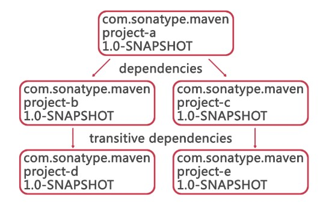

# 20190410_Maven

## 用Maven搭建SpringMVC项目开发环境

### POM(Project Object Model)

* 是一个xml配置文件，通过配置完成很多功能

### Dependency Management

### Coordinates

* groupId, artifactId, version,` packaging构成坐标，唯一标识一个包

## 在IntelliJ中使用Maven创建SpringMVC项目

1. 创建maven项目
   * create from archetype: maven-archetype-webapp
   * 选择settings.xml时用maven/conf/setting.xml
2. 配置tomcat服务器
   * Tomcat-local: war-exploded 