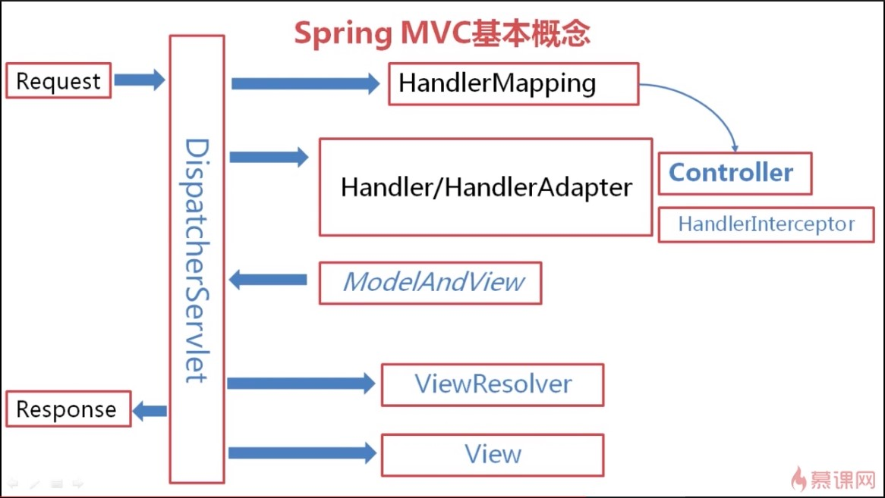
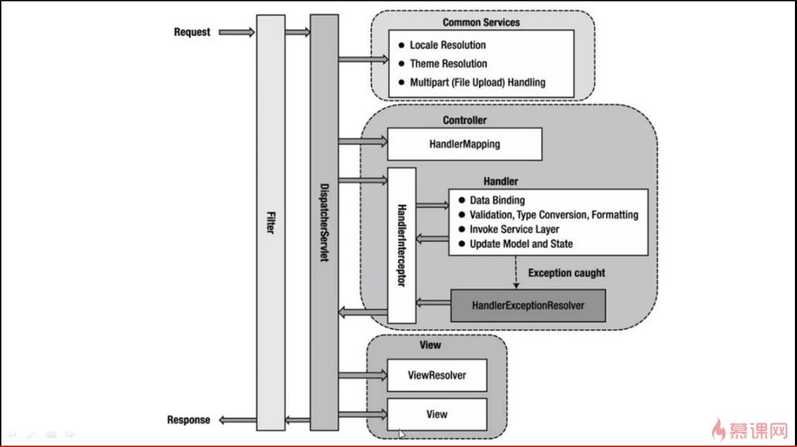

# 20190410_SpringMVC

## SpringMVC基本概念

### 前端控制器DispatcherServlet

* DipatcherServlet是前端控制器，前端的用户请求通过DispatcherServlet进行分发，到达合适的Controller来生产合适的业务数据Model，Model再通过DispatcherServlet传递到View完成最终页面呈现

### 控制器Controller

* Controller调用页面逻辑生成Model

### HandlerAdapter

* 在DispatcherServlet中调用的Controller以Handler形式出现
* 而HandlerAdapter遵循适配器模式，将不同类型的Handler适配成DispatcherServlet适用的Handler

### HandlerInterceptor

```java
void afterCompletion(HttpServletRequest request, HttpServletResponse response, Object Handler, Exception ex);

void postHandle(HttpServletRequest request, HttpServletResponse, Object handler, ModelReview modelReview);

boolean preHandle(HttpServletRequest request, HeepServletResponse response, Object Handler);
```

* 拦截器，是一个接口，对Controller加料

### HandlerMapping

* 帮助DispatcherServlet获取正确的Controller

### HandlerExecutionChain
    |--------------------|
    | HandlerInterceptor |
    ||------------------||
    ||    Controller    ||
    ||------------------||
    |--------------------|

* Excution Chain: preHandle -> Controller method -> postHandle -> afterCompletion

### ModelAndView

* 是Model的具体表现

### ViewResolver

* 视图解析器，告诉DispatcherServlet用哪一个视图做呈现

### View

* 呈现页面



                                        